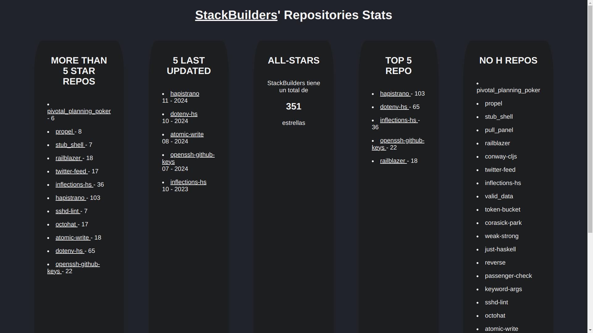
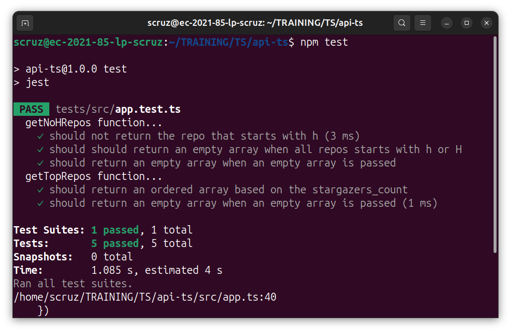

API-TS

This is a website that shows some stats of [StackBuilders](https://github.com/stackbuilders)' github repositories.

It was developed using the `github API` + `TS`

You'll be able to see:
* all the 5-star repos
* last updated repos
* total stars of SB repos
* top 5 repos with the most stars
* repos that don't start with the letter **H**



This project also count with tests made with `Jest`, they can be run by the following command line:
```bash
npm test
```


